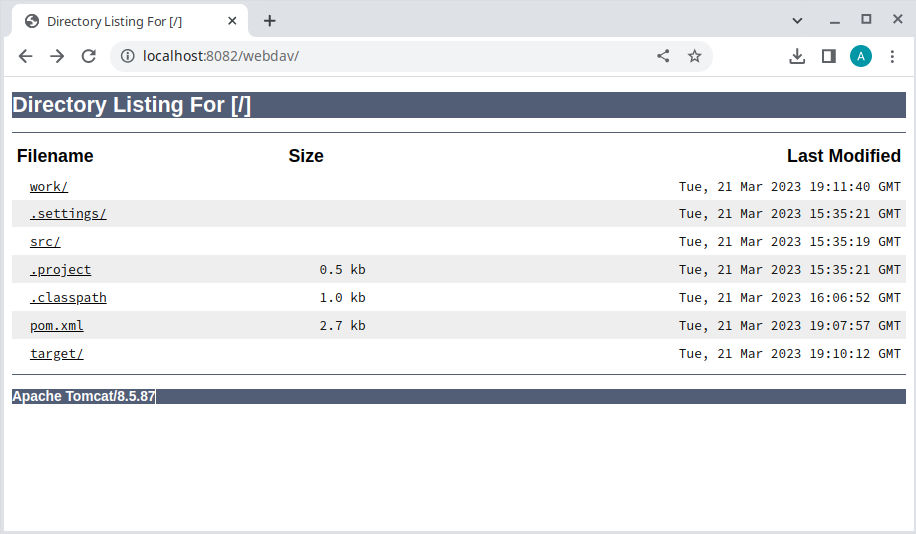

A WebDAV server based on Apache Tomcat's Webdav servlet and embedded Tomcat server
---

This is a WebDAV server based on Apache Tomcat's WebDAV servlet and embedded Tomcat server

Current status: alpha/test

## Feature list
- It runs on http://localhost:8080/webdav
- It serves the current working directory in which the app is started
- Added (BASIC) authentication
- Added command line aguments so that various parameters can be changed:
- It requires a folder 'work' for the embedded Tomcat instance, if the folder isn't present,
it is created.



# Build
```
mvn package
```
# Run

```
java -jar webdav-0.1.0.jar
```
Note that if you build from source the file name is webdav-0.1.0-jar-with-dependencies.jar, in target/ folder.

## usage 

```
java -jar webdav-0.1.0.jar -h

usage: webdav-0.1.0
 -h,--help                help
 -H,--host <hostname>     set host
 -p,--port <port>         set port
 -P,--path <path>         set path, default current working dir
 -R,--realm <realm>       set realm, default 'simple'
 -u,--user <username>     set user
 -w,--passwd <password>   set password, omit this and it would prompt for
                          it if -u is specified
```

note that the app can be run without specifying arguments.

requires JDK >= 1.8

Note that on starting, it creates a folder "work" in the current directory. This is needed for the embedded Tomcat instance to operate.
And it serves the current directory on webdav at http://localhost:8080/webdav

On running, point the web browser to http://localhost:8080/webdav, you should see the directory listing of your current work directory. For more functionality, it requires a WebDAV client to interact with the WebDAV server

To enable authentication, specify a userid using -u option and password would be prompted if the -w option is not specified.

# Attributions

The server is really [Apache Tomcat https://tomcat.apache.org/](https://tomcat.apache.org/).
One of the most widely used open-source implementation of the Jakarta Servlet, JSP technologies.

## Origin

github repository: 
[https://github.com/ag88/embtomcatwebdav](https://github.com/ag88/embtomcatwebdav)

I've made efforts to tailor the WebDAV servlet so that it works as a standalone app. 
Developing this has taken quite some effort mainly in adding features, getting it to work and rather extensive tests. if you use this app and found it useful, i'd really appreciate it if you could support my efforts [](https://donorbox.org/embedded-tomcat-webdav-server).
you could also help simply starring this repository ;)
